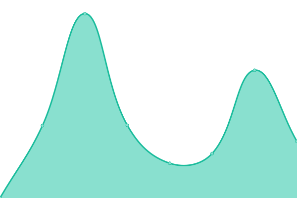

# [📈 Live Status](https://demo.upptime.js.org): <!--live status--> **🟥 Complete outage**

This repository contains the open-source uptime monitor and status page for [Upptime](https://upptime.js.org), powered by [Upptime](https://github.com/upptime/upptime).

With [Upptime](https://upptime.js.org), you can get your own unlimited and free uptime monitor and status page, powered entirely by a GitHub repository. We use [Issues](https://github.com/upptime/upptime/issues) as incident reports, [Actions](https://github.com/ProFinn24/status/actions) as uptime monitors, and [Pages](https://demo.upptime.js.org) for the status page.

<!--start: status pages-->
<!-- This summary is generated by Upptime (https://github.com/upptime/upptime) -->
<!-- Do not edit this manually, your changes will be overwritten -->
<!-- prettier-ignore -->
| URL | Status | History | Response Time | Uptime |
| --- | ------ | ------- | ------------- | ------ |
|  [F1nn.net](https://f1nn.net) | 🟥 Down | [f1nn-net.yml](https://github.com/yS4VELwjydXFZ2VY6FsNqycP7pVYZyp9DCg4jUk/status/commits/HEAD/history/f1nn-net.yml) | 

 0ms
     
 | 

<a href="https://status.f1nn.net/history/f1nn-net">0.00%</a>
    

|  [ProShisha24](https://proshisha24.de) | 🟥 Down | [pro-shisha24.yml](https://github.com/yS4VELwjydXFZ2VY6FsNqycP7pVYZyp9DCg4jUk/status/commits/HEAD/history/pro-shisha24.yml) | 

 0ms
     
 | 

<a href="https://status.f1nn.net/history/pro-shisha24">0.00%</a>
    

|  [Hiroshima.fun](https://hiroshima.fun) | 🟥 Down | [hiroshima-fun.yml](https://github.com/yS4VELwjydXFZ2VY6FsNqycP7pVYZyp9DCg4jUk/status/commits/HEAD/history/hiroshima-fun.yml) | 

 0ms
     
 | 

<a href="https://status.f1nn.net/history/hiroshima-fun">0.00%</a>
    

<!--end: status pages-->

[**Visit our status website →**](https://demo.upptime.js.org)

## 📄 License

- Powered by: [Upptime](https://github.com/upptime/upptime)
- Code: [MIT](./LICENSE) © [Upptime](https://upptime.js.org)
- Data in the `./history` directory: [Open Database License](https://opendatacommons.org/licenses/odbl/1-0/)
